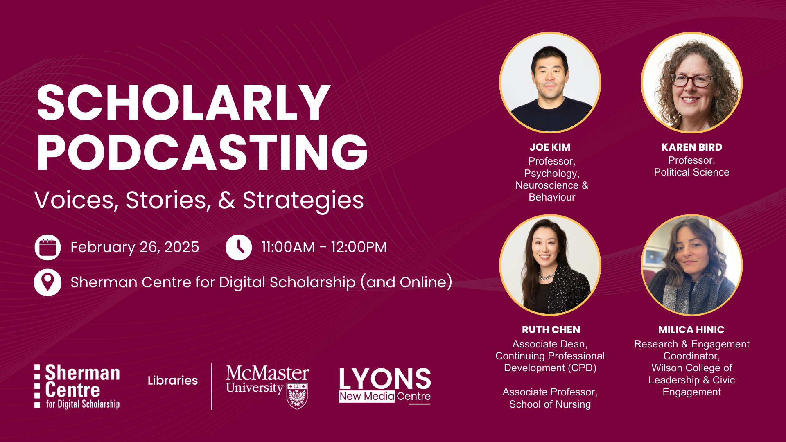

# Scholarly Podcasting: Voices, Stories, & Strategies

Podcasting has emerged as a powerful tool for scholars to share knowledge, foster dialogue, and reach audiences far beyond traditional academic channels. Podcasts are increasingly utilized to mobilize knowledge, enhance teaching, build academic communities, and collect research data. However, conventional conceptions of research impact continue to privilege traditionally peer-reviewed publications over this more flexible and dynamic form of scholarly activity.  

As movements like DORA (the San Francisco Declaration on Research Assessment) challenge these traditional paradigms, this panel will explore how podcasting can be more fully (and fairly) recognized within evolving frameworks of research assessment. Panelists will draw on their own podcasting initiatives, spanning community-based research series to pedagogical applications in the classroom, to consider podcasting not only as tool for traditional knowledge dissemination but as a method of scholarly and community-based knowledge production. 

Together, we will examine the methodological, pedagogical, and communicative possibilities of podcasting, and chart a course for broader recognition and celebration of the medium’s impact within the field of research assessment.   

## Workshop Slides

Coming Soon.
